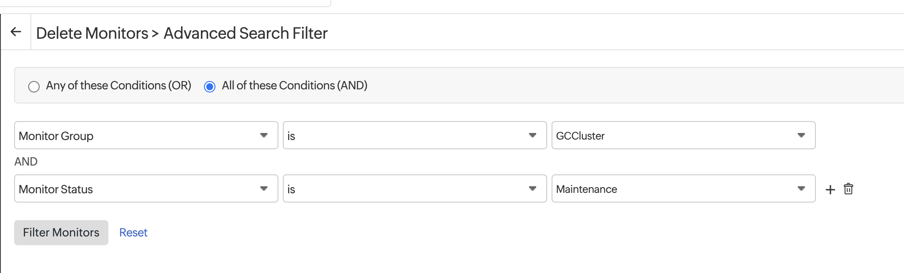

### Safely rolling nodes
There are a number of processes that will force all the nodes in a cluster to roll over, including upgrading node kubernetes versions, other changes to the Node group, such as changing the Instance Type or any changes whatsoever to the User Data block.

#### Pre-work
1. Ensure you have an up-to-date kubeconfig for the cluster, in case Rancher has issues
1. Put the [cluster monitor group](https://www.site24x7.com/app/client#/home/monitor-groups/195989000086800154/summary) in maintenance mode on Site24x7. Go to the monitor group, select the hamburger menu next to the name, and select a duration under "Schedule maintenance" (most likely 60 minutes).
1. Check the application monitor groups, and make sure they are green.
1. Pull up the [Rancher / Cluster (Nodes) monitor](https://r.notch8.cloud/k8s/clusters/c-6zfxc/api/v1/namespaces/cattle-monitoring-system/services/http:rancher-monitoring-grafana:80/proxy/d/rancher-cluster-nodes-1/rancher-cluster-nodes?orgId=1) and check the current behavior. Once you start rolling over the nodes, some of the graphs will get pretty erratic for a little bit as old nodes go down and new nodes go up, but what you're looking for is that the new nodes seem to actually be taking over the load from the old nodes (not just coming up and not getting any traffic).
1. You can see more detailed node information on the [Kubernetes Compute Node (Pods) dashboard](https://r.notch8.cloud/k8s/clusters/c-6zfxc/api/v1/namespaces/cattle-monitoring-system/services/http:rancher-monitoring-grafana:80/proxy/d/200ac8fdbfbb74b39aff88118e4d1c2c/kubernetes-compute-resources-node-pods?orgId=1&refresh=10s&var-datasource=prometheus&var-cluster=&var-node=ip-192-168-109-21.us-west-2.compute.internal)
1. You can also pull up the [Cluster Nodes view in Rancher](https://r.notch8.cloud/dashboard/c/c-6zfxc/explorer/node). This is where you'll see nodes cordoned and drained, and new nodes coming up.


#### Roll the nodes
There are two possible scenarios - creating a completely new node group - needed for changing instance sizes, for example, and rolling all of the existing nodes in a cluster. Depending on how big, and how risky, the change is, you might choose to create a new node group, in order to have a more controlled rollout of the changes.

##### Roll all nodes in existing node group for checking if all is well
1. Check the health of the cluster prior to rolling nodes
1. Make a no-op edit on the "User Data" (Cluster Management -> Clusters -> Edit Config, scroll down to User Data)
1. It should automatically roll all the nodes over. In Rancher, the cluster will go to "Updating"
1. Monitor the [Cluster Nodes view in Rancher](https://r.notch8.cloud/dashboard/c/c-6zfxc/explorer/node) - more nodes should get spun up, the old nodes should get cordoned, and workloads should be moved from the old nodes to the new nodes.
1. Go to the new nodes, and check whether they have any workloads in "Crashloopbackoff" status, or that have a lot of restarts - this indicates a potential configuration error.

###### Troubleshooting
1. A common issue is with the instance metadata service (IMDSv2) - it needs to *either* be set to "optional" *or* allow for 2 hops - otherwise some services will not be able to retrieve information they need. You can check this by going to console.The [AWS EC2 page](https://us-west-2.console.aws.amazon.com/ec2/home?region=us-west-2#Instances:instanceState=running;sort=desc:launchTime), right-click on one of the new instance names, go to 'instance settings' -> 'Modify instance metadata options' and check whether the IMDSv2 is optional or required, and the number of hops allowed.

##### [WIP] Controlled roll-over
This is for potentially breaking changes, and when we want to be able to test infrastructure changes on only certain namespaces (such as the dev namespaces) first. There is still some risk, since some services, such as ElasticSearch, do not have multiple instances. 

1. Setup: make sure you are in the right context! run `kubectl config current-context` and ensure you are in the context you expect.
1. List the current nodes
```bash
kubectl get nodes -o 'custom-columns=NAME:.metadata.name,NODE-GROUP:.metadata.labels.eks\.amazonaws\.com/nodegroup,INSTANCE-TYPE:.metadata.labels.node\.kubernetes\.io/instance-type,STATUS:.status.conditions[-1].type,TAINTS:.spec.taints[-1]'
```
```bash
kubectl get nodes -o json | jq '.items[] | {
  name: .metadata.name,
  nodeGroup: .metadata.labels."eks.amazonaws.com/nodegroup",
  instanceType: .metadata.labels."node.kubernetes.io/instance-type",
  taints: .spec.taints
}'
```

#### Post-work
1. Go to the monitors listed in pre-work and ensure that the nodes have stabilized, and that they appear to be getting traffic. 
1. Pull up all the [pods on the cluster](https://r.notch8.cloud/dashboard/c/c-6zfxc/explorer/pod) and ensure it is showing All Namespaces. Sort by "Restarts" and ensure there are no pods continually re-starting (restarts indicate a potential problem), and sort by "State" and make sure that there aren't any in "crashloopback" or other bad states.
1. View the logs of a few production rails pods and make sure they appear to be getting traffic (if the log just shows they've come up successfully, but nothing else, most likely no traffic is coming through to the logs)
1. Delete Site24x7 monitors for nodes that have been scaled down. First check that the new nodes are showing green in the [GCCluster monitor group](https://www.site24x7.com/app/client#/home/monitor-groups/195989000086800154/summary). Then go to [Bulk action -> Delete monitors](https://www.site24x7.com/app/client#/admin/inventory/bulk-action/8/filter) and add filters for "Monitor Group is GCCluster" and "Monitor Status is Maintenance" (the new nodes should show as "Active" in this list, not "Maintenance"), hit search, then do a sanity check of the number of monitors it wants to delete, and if it seems correct, delete the old monitors. Then you can take the monitor out of maintenance.

